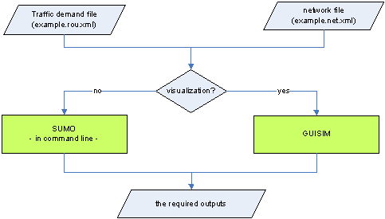

# SUMO
 
This includes [**SUMO offical packages**](https://github.com/eclipse/sumo). 

Check Google Drive for introductions about how to run her code provided by Sookyoung. 

Files tree:

|Dir path|Dir or File|Notes|
|:-|:-:|:-|
|- data|d|Official dir.|
|- docs|d|Official dir.| 
|- - tutorial|d|Official examples.|
|- tools|d|Official dir.|
|- dayuan|d|My sumo projects, examples.|
|- - [aSimpleSumo.md](aSimpleSumo.md)|f|My example for a simple road net.|
|- - [2ndSimpleSumo.md](2ndSimpleSumo.md)|f|My 2nd SUMO example. A bit more complex then above one.|
|- - imgs|d|Some screenshots or recording vedios for my projects or examples.|
||

------
# File structure for a SUMO project 

- (*) Link geometry data can also be defined in the link file quickstart.edg.xml.
- (**) It is an optional file. If this file is not given, lane connections and traffic movements will be generated by defaults.

## For executing:

------

# [My simple SUMO example](./dayuan/aSimpleSumo.md)

I set up a simple SUMO, it's friednly to beginners. You can find it [here](./dayuan/aSimpleSumo.md).

Few screenshots about it:

  

------
# [Second SUMO example: a bit more complex](./dayuan/2ndSimpleSumo.md)

**Difference** **& Improvement**:
- The road condition is more complex, two direction three lanes are added.
- Different edge(road segment) types are used.
- Different lane is assigned to specific lane.
- Use `netconvert -c dayuan.netccfg` to generate "net.xml" file.

Few screenshots about it:

  

# [Third SUMO example: use TraCI](./dayuan/3rdSumoTraCI.md)

This is an example using TraCI to control and change traffic lights.

