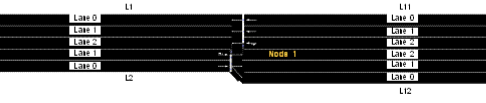
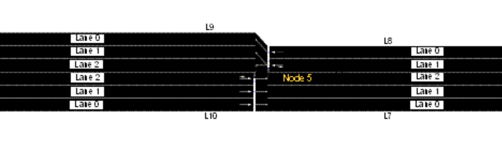
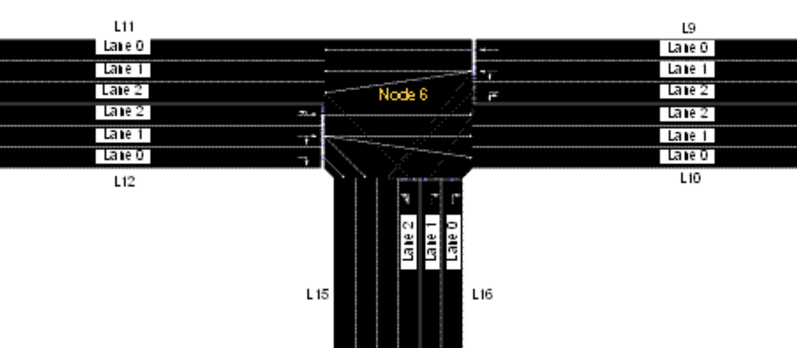
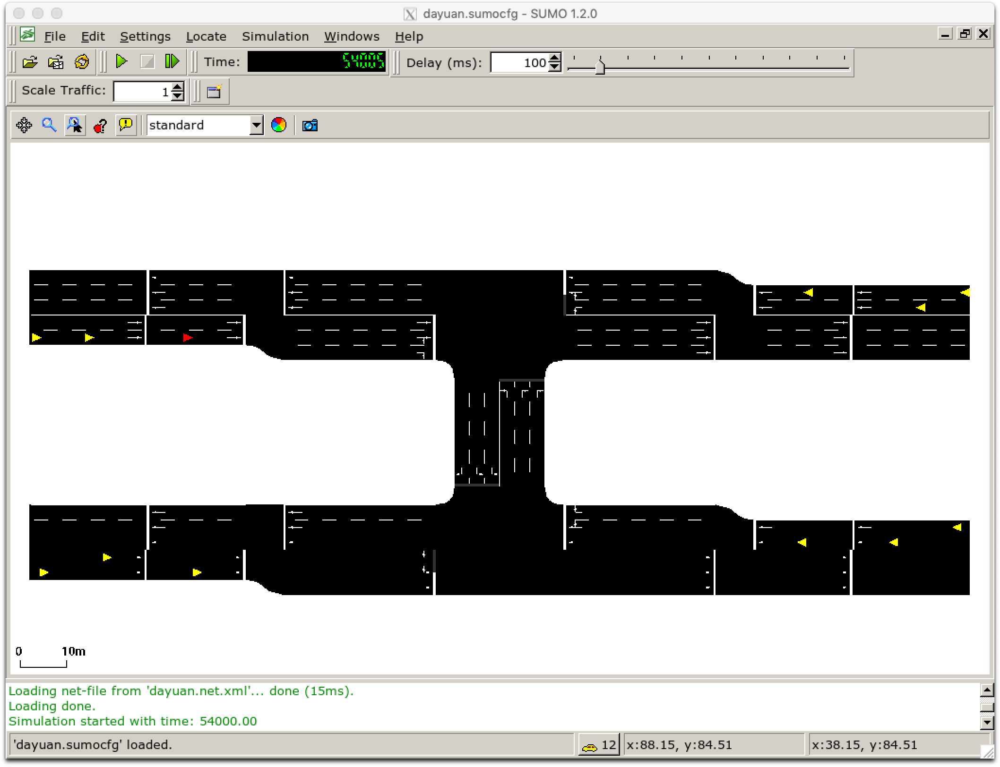

# 2nd Simple SUMO 

This is a bit more complex SUMO example based on the [first simple sumo](./aSimpleSumo.md).

**Difference** **& Improvement**:
- The road condition is more complex, two direction three lanes are added.
- Different edge(road segment) types are used.
- Different lane is assigned to specific lane.
- Use `netconvert -c dayuan.netccfg` to generate "net.xml" file.


I want to implement this road network:


## Step 1: Nodes
    
All nodes are set up in ["dayuan.nod.xml"](../docs/tutorial/quickstart_dyt/data/dayuan.nod.xml) file. In this file, each node is assigned with its coordinates (x,y).

The definitions of the attributes in the node file are listed below.

- (a) id: the ID name of the node, defined by users with numbers, word strings or both.
- (b) x: the x-coordinate location of the defined node (in meters)
- (c) y: the y-coordinate location of the defined node (in meters)
- (d) type: the signal control type of the defined node. It is an optional attribute and defined with priority and traffic_light for unsignalized and signalized intersections respectively.

## Step 2: Edges (links)

All edges (road segments, or called "link" in SUMO) are set up in ["dayuan.edg.xml"](../docs/tutorial/quickstart_dyt/data/dayuan.edg.xml) file.

The defined attributes include:

- (a) id: link ID, defined by users with numbers, word strings or both.
- (b) from: ID of the upstream node of the respective link.
- (c) to: ID of the downstream node of the respective link.
- (d) type: ID of the link type, defined in the link type file.
- (e) allow/disallow: ID of the vehicle group which is defined in the SUMO and might not be identical with the vehicle types defined by users. 

The definiton of those types are set up in ["dayuan.typ.xml"](../docs/tutorial/quickstart_dyt/data/dayuan.typ.xml) file.

Four attributes are defined:

- (a) id: defined by users with numbers, word strings or both.
- (b) priority: driving priority based on traffic regulations and is defined with numbers. The higher the number, the higher the priority for the respective road. The priority information will override information from the node file, if both of them exist.
- (c) numLanes: number of lanes on the respective road.
- (d) speed: maximum allowed link speed.
- Types (a) and (b) are for the eastbound and westbound roads with 3 lanes and 2 lanes respectively. Type (c) is then for the northbound and southbound roads with a lower priority.


## Step 3: Connections between lanes

Since each edge has 3 or 2 lanes, they can not connect to each other freely. The connection between each lanes are set up in ["dayuan.con.xml"](../docs/tutorial/quickstart_dyt/data/dayuan.con.xml) file.

The meaning of each attribute is as following:

- (a) from: ID of the link which the traffic movements will be specified.
- (b) to: ID of the link which is the downstream link of the above defined link.
- (c) fromLane/toLane: lane number of the defined link in (a) and the lane number of the link in (b), which are connected.

For example, the first row `<connection from="L2" to="L12" fromLane="0" toLane="0"/>` and the second row `<connection from="L2" to="L12" fromLane="0" toLane="1"/>` in ["dayuan.con.xml"](../docs/tutorial/quickstart_dyt/data/dayuan.con.xml) means that the traffic on Lane 0 of Link L2 will only use Lanes 0 and 1 of Link L12 (see first Figure below). In contrast, second Figure below shows the allowed traffic movements based on the default setting as reference. Another example is given in third Figure below for the specification of the traffic movements on Links L9, L12 and L16, defined in ["dayuan.con.xml"](../docs/tutorial/quickstart_dyt/data/dayuan.con.xml).





## Step 4: Network generation

All 4 files above will be used to generate the network file ["dayuan.net.xml"](../docs/tutorial/quickstart_dyt/data/dayuan.net.xml) using `netconvert` command. 

Before that, let set up all parameters into 1 file ["dayuan.netccfg"](../docs/tutorial/quickstart_dyt/data/dayuan.netccfg) since there are too much parameters. 

In this parameter file ["dayuan.netccfg"](../docs/tutorial/quickstart_dyt/data/dayuan.netccfg),  we will set ["dayuan.nod.xml"](../docs/tutorial/quickstart_dyt/data/dayuan.nod.xml),  ["dayuan.edg.xml"](../docs/tutorial/quickstart_dyt/data/dayuan.edg.xml), ["dayuan.typ.xml"](../docs/tutorial/quickstart_dyt/data/dayuan.typ.xml), ["dayuan.con.xml"](../docs/tutorial/quickstart_dyt/data/dayuan.con.xml) all 4 above files as input files. And then set a out put file, which is our network file ["dayuan.net.xml"](../docs/tutorial/quickstart_dyt/data/dayuan.net.xml).

As shown in SUMO project files structure:


BTW, If u-turn movements are not allowed, the command <no-turnarounds value="true"/> should be added to the configuration file. As stated previously, the prohibition of u-turn movements can only be conducted globally.

## Step 4: Traffic demand

Then I set up traffic flow information into ["dayuan.rou.xml"](../docs/tutorial/quickstart_dyt/data/dayuan.rou.xml).

**Firstly** I define 4 types of cars. BTW the sigma parameter means all drivers are 50% perfect in driving.

Vehicle type related attributes include:

- (a) id: ID of the vehicle type, defined by users with numbers, word strings or both;
- (b) accel: maximum acceleration of the respective vehicle type (in m/s2);
- (c) decal: maximum deceleration of the respective vehicle type (in m/s2);
- (d) sigma: drivers’ imperfection in driving (between 0 and 1);
- (e) length: vehicle length (in meters);
- (f) maxSpeed: maximum vehicular velocity (in m/s);
- (g) color: color of the vehicle type. It is defined with 3 numbers (between 0 and 1) for red, green and blue respectively. Values are separated by comma and in quotes with no space between the values. For example, 1,0,0 represents the red color, 0,1,0 represents green color and 0,0,1 represents blue color.
- The sequence of the attributes can be changed. The attribute sigma is assigned as 0.5 for all vehicle types.

**Secondly** 12 routes are assigned to let each vehicle to select from.

Following the vehicle type information traffic route data need to be defined as well. The input attributes include:

- (a) id: ID of a certain route and defined by users with numbers, word strings or both.
- (b) edges: The sequence of the names of the links, composing the defined route.


**Thirdly** it's the traffic flow (traffic demand) design.

Traffic demand data are defined with four attributes:

- (a) depart: departure time of a certain vehicle.
- (b) id: ID of a certain vehicle and defined by users with numbers, word strings or both.
- (c) route: the route used by the defined vehicle;
- (d) type: ID of the defined vehicle type.

## Step 5: Run

All having all above, we can run the simulation using this command `sumo-gui -c dayuan.sumocfg`. 


## Result

Few screenshots of runing the simulation:



FYI, in ["dayuan.settings.xml"](../docs/tutorial/quickstart_dyt/data/dayuan.settings.xml) I set the run time from 54000 to 54100. You can change it as you want.

```
    <time>
        <begin value="54000"/>
        <end value="54100"/>
    </time>
```

----
Reference:

[1] https://sumo.dlr.de/wiki/Tutorials/Quick_Start_old_style (Better, used configuration files to set up.)

[2] https://sumo.dlr.de/wiki/Tutorials/quick_start (Use SUMO GUI to set up but not easy to do.)