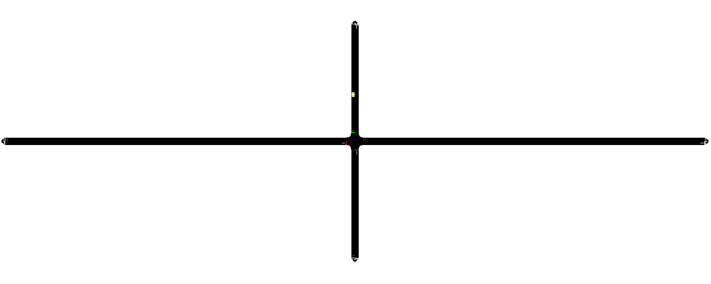

# 3rd SUMO project using TraCI

This is a SUMO example using [**TraCI**](https://sumo.dlr.de/docs/TraCI.html).


I want to implement this road network:



## Example description
Our example plays on a simple signalized intersection with four approaches. We only have traffic on the horizontal axis and important vehicles (like trams, trains, fire engines, ...) on the vertical axis from north to south. On the approach in the north we have an induction loop to recognize entering vehicles. While no vehicle enters from the north we give green on the horizontal axis all the time but when a vehicle enters the induction loop we switch the signal immediately so the vehicle can cross the intersection without a stop. [1]


## Step 1: Nodes
    
All nodes are set up in ["dayuan.cross.nod.xml"](../docs/tutorial/traci_tls_dyt/data/dayuan.cross.nod.xml) file. In this file, each node is assigned with its coordinates (x,y).

The definitions of the attributes in the node file are listed below.

- (a) ***id***: the ID name of the node, defined by users with numbers, word strings or both.
- (b) ***x***: the x-coordinate location of the defined node (in meters)
- (c) ***y***: the y-coordinate location of the defined node (in meters)
- (d) ***type***: the signal control type of the defined node. It is an optional attribute and defined with priority and traffic_light for unsignalized and signalized intersections respectively.

## Step 2: Edges (links)

All edges (road segments, or called "link" in SUMO) are set up in ["dayuan.cross.edg.xml"](../docs/tutorial/traci_tls_dyt/data/dayuan.cross.edg.xml) file.

The defined attributes include:

- (a) ***id***: link ID, defined by users with numbers, word strings or both.
- (b) ***from***: ID of the upstream node of the respective link.
- (c) ***to***: ID of the downstream node of the respective link.
- (d) ***priority***: driving priority based on traffic regulations and is defined with numbers. The higher the number, the higher the priority for the respective road. The priority information will override information from the node file, if both of them exist.
- (e) ***numLanes***: number of lanes on the respective road.
- (f) ***speed***: maximum allowed link speed.
- // We can also put priority, numLanes, speed properties in a seperate *.typ.xml as [example 2](2ndSimpleSumo.md).
- // (g) type: ID of the link type, defined in the link type file. 
- // (h) allow/disallow: ID of the vehicle group which is defined in the SUMO and might not be identical with the vehicle types defined by users. 


## Step 3: Connections between lanes

Each edges are connected with others. The connection between edges are set up in in ["dayuan.cross.con.xml"](../docs/tutorial/traci_tls_dyt/data/dayuan.cross.con.xml) file.

```
NOTE: If each edge has more than 2 lanes, they can not connect to each other freely. 
The connection between each lanes are set up in "dayuan.cross.con.xml" file 
using "fromLane/toLane" attributes, see more on 2nd example.
```

The meaning of each attribute is as following:

- (a) ***from***: ID of the link which the traffic movements will be specified.
- (b) ***to***: ID of the link which is the downstream link of the above defined link.
- // (c) fromLane/toLane: lane number of the defined link in (a) and the lane number of the link in (b), which are connected.


## Step 4: Network generation  (netconvert)

All 3 files above will be used to generate the network file ["dayuan.cross.net.xml"](../docs/tutorial/traci_tls_dyt/data/dayuan.cross.net.xml) using [`netconvert` command](https://sumo.dlr.de/docs/NETCONVERT.html) (see [more](https://sumo.dlr.de/docs/Networks/Import.html) about using `netconvert` to convert other third-party formats to network file "*.net.xml"). 

Before that, let set up all parameters into 1 file ["dayuan.cross.netccfg"](../docs/tutorial/traci_tls_dyt/data/dayuan.cross.netccfg) since there are too much parameters. 

In this parameter file ["dayuan.cross.netccfg"](../docs/tutorial/traci_tls_dyt/data/dayuan.cross.netccfg),  we will set ["dayuan.cross.nod.xml"](../docs/tutorial/traci_tls_dyt/data/dayuan.cross.nod.xml),  ["dayuan.cross.edg.xml"](../docs/tutorial/traci_tls_dyt/data/dayuan.cross.edg.xml), ["dayuan.cross.con.xml"](../docs/tutorial/traci_tls_dyt/data/dayuan.cross.con.xml) all 3 above files as input files. And then set a out put file, which is our network file ["dayuan.cross.net.xml"](../docs/tutorial/traci_tls_dyt/data/dayuan.cross.net.xml).

As shown in SUMO project files structure:


BTW, If u-turn movements are not allowed, the command `<no-turnarounds value="true"/>` should be added to the configuration file. As stated previously, the prohibition of u-turn movements can only be conducted globally.

Run `netconvert -c dayuan.cross.netccfg` to generate file ["dayuan.cross.net.xml"](../docs/tutorial/traci_tls_dyt/data/dayuan.cross.net.xml).

```python
$ netconvert -c dayuan.cross.netccfg
Loading configuration... done.
Parsing nodes from 'dayuan.cross.nod.xml'... done.
Parsing edges from 'dayuan.cross.edg.xml'... done.
Parsing connections from 'dayuan.cross.con.xml'... done.
 Import done:
   9 nodes loaded.
   16 edges loaded.
Removing self-loops... done (0ms).
Removing empty nodes... done (0ms).
   0 nodes removed.
Moving network to origin... done (0ms).
Computing turning directions... done (0ms).
Assigning nodes to traffic lights... done (0ms).
Sorting nodes' edges... done (0ms).
Computing node shapes... done (1ms).
Computing edge shapes... done (0ms).
Computing node types... done (0ms).
Computing priorities... done (0ms).
Computing approached edges... done (0ms).
Guessing and setting roundabouts... done (0ms).
Computing approaching lanes... done (0ms).
Dividing of lanes on approached lanes... done (0ms).
Processing turnarounds... done (0ms).
Rechecking of lane endings... done (0ms).
Computing traffic light control information... done (0ms).
Computing node logics... done (1ms).
Computing traffic light logics... done (0ms).
 1 traffic light(s) computed.
Building inner edges... done (0ms).
-----------------------------------------------------
Summary:
 Node type statistics:
  Unregulated junctions       : 0
  Priority junctions          : 9
  Right-before-left junctions : 0
 Network boundaries:
  Original boundary  : -301.00,-101.00,301.00,101.00
  Applied offset     : 301.00,101.00
  Converted boundary : 0.00,0.00,602.00,202.00
-----------------------------------------------------
Writing network... done (2ms).
Success.
```

## Step 5: Traffic demand (randomTrips.py)

In 2nd example I set up traffic flow information into ["dayuan.rou.xml"](../docs/tutorial/quickstart_dyt/data/dayuan.rou.xml) by hand. **Firstly** I define 4 types of cars. 
**Secondly** 12 routes are assigned to let each vehicle to select from.
**Thirdly** it's the traffic flow (traffic demand)/route design.

## 5.1 Generate a route: 

BUT here, I want to ***generate randomly a route*** using python script.

[Traffic Demand](https://sumo.dlr.de/docs/Demand/Introduction_to_demand_modelling_in_SUMO.html) is the word we use to descripte how many vehicles we will have, types of vehicles, the route of each vehicles.

A ***trip*** is a vehicle movement from one place to another defined by the starting edge (street), the destination edge, and the departure time. 

A ***route*** is an expanded trip, that means, that a route definition contains not only the first and the last edge, but all edges the vehicle will pass.

There are several methods to generate routes for SUMO. DUAROUTER is one of them.
[DUAROUTER (dynamic user assignment (DUA) router)](https://sumo.dlr.de/docs/DUAROUTER.html) is used to turn your trips into routes. Another popular way is using Randomization `Tools/Trip#randomTrips.py`, which is a quick way to get some traffic if you do not have access to any measurements but the results are highly unrealistic. See [Tools/Trip#randomTrips.py](https://sumo.dlr.de/docs/Tools/Trip.html#randomtripspy).

To use "Tools/Trip#randomTrips.py", a possible way is run a command like this:
`$ ../../../../tools/randomTrips.py -n dayuan.cross.net.xml -o dayuan.trips.trips.xml --fringe-factor 100 -p 1 --route-file dayuan.cross.rou.xml --vehicle-class bus`

- ***../../../../tools/randomTrips.py***: Find the correct path of randomTrips.py file.
- ***-n dayuan.cross.net.xml***: As input file. Usually it's a network file.
- ***-o dayuan.trips.trips.xml***: As output file. `randomTrips.py` generates a trip file. Not route file by default.
- ***--route-file dayuan.cross.rou.xml***: Add "--route-file" attribute it will call DUAROUTER automatically backend and generate route file for us. 
- ***--fringe-factor 100***: The option --fringe-factor <FLOAT> increases the probability that trips will start/end at the fringe of the network. If the value 10 is given, edges that have no successor or no predecessor will be 10 times more likely to be chosen as start- or endpoint of a trip. This is useful when modelling through-traffic which starts and ends at the outside of the simulated area.
- ***-p 1***: The arrival rate is controlled by option --period/-p <FLOAT> (default 1). By default this generates vehicles with a constant period and arrival rate of (1/period) per second. By using values below 1, multiple arrivals per second can be achieved.

```python
$ ../../../../tools/randomTrips.py -n dayuan.cross.net.xml -o dayuan.trips.trips.xml --fringe-factor 100 -p 1 --route-file dayuan.cross.rou.xml --vehicle-class bus
calling  /usr/local/opt/sumo/share/sumo/bin/duarouter -n dayuan.cross.net.xml -r dayuan.trips.trips.xml -o dayuan.cross.rou.xml --ignore-errors --begin 0 --end 3600 --no-step-log --no-warnings
Success.
```

*In the official example, it use [`python runner.py`](../docs/tutorial/traci_tls/) to generate the route and run the example. Even though the official website says "The route data is generated randomly by the script" but it doesn't mean it generated the route randomly, it just random write some lines into the rou.xml file. Check "generate_routefile()" in [runner.py](../docs/tutorial/traci_tls/).*

## Step 6: Induction Loops (感应线圈) Detectors

Here are some introduction to Inductino Detectors: 

- [Induction Loops Detectors (E1)](https://sumo.dlr.de/docs/Simulation/Output/Induction_Loops_Detectors_(E1).html). There is also an [E2 detector](https://sumo.dlr.de/docs/Simulation/Output/Lanearea_Detectors_(E2).html) and [E3](https://sumo.dlr.de/docs/TraCI/Multi-Entry-Exit_Detectors_Value_Retrieval.html). 

- [TraCI/Induction Loop Value Retrieval](https://sumo.dlr.de/docs/TraCI/Induction_Loop_Value_Retrieval.html)

*BUT in the official example, it uses a [det.xml file](../docs/tutorial/traci_tls/data/cross.det.xml). Then use*
```python
if traci.inductionloop.getLastStepVehicleNumber("0") > 0:
    # a vehicle is detected
    # there is a vehicle from the north, switch
    ...do something...

#getLastStepVehicleNumber(self, loopID)
    getLastStepVehicleNumber(string) -> integer
 
    #Returns the number of vehicles that were on the named induction loop within the last simulation step.
```
*in python file to read it. [(develop doc)](https://sumo.dlr.de/pydoc/traci._inductionloop.html)*

## Analyze [runner.py](../docs/tutorial/traci_tls/), [TraCI/Interfacing TraCI from Python](https://sumo.dlr.de/docs/TraCI/Interfacing_TraCI_from_Python.html)

### a) Import SUMO/tools 

This is standard and same for almost all cases. Just copy:
```python
# we need to import python modules from the $SUMO_HOME/tools directory
if 'SUMO_HOME' in os.environ:
    tools = os.path.join(os.environ['SUMO_HOME'], 'tools')
    sys.path.append(tools)
else:
    sys.exit("please declare environment variable 'SUMO_HOME'")
```
### b) Start SUMO as a server, connect and run 

```python
    options = get_options()

    # this script has been called from the command line. It will start sumo as a
    # server, then connect and run
    if options.nogui:
        sumoBinary = checkBinary('sumo')
    else:
        sumoBinary = checkBinary('sumo-gui')
```

### c) Run TraCI
```python
    import traci  # noqa

    # this is the normal way of using traci. sumo is started as a
    # subprocess and then the python script connects and runs
    traci.start([sumoBinary, "-c", "data/cross.sumocfg",
                             "--tripinfo-output", "tripinfo.xml"])
    # use TraCI to do something
    step = 0
    while step < 1000:
        traci.simulationStep()
        if traci.inductionloop.getLastStepVehicleNumber("0") > 0:
            traci.trafficlight.setRedYellowGreenState("0", "GrGr")
        step += 1

    traci.close()
```
In [runner.py](../docs/tutorial/traci_tls/) it created a fucntion `run()` to use TraCI to do its stuff. 

### d) Run a simulation until all vehicles have arrived: ([develop doc](https://sumo.dlr.de/pydoc/traci._simulation.html))
```python
  while traci.simulation.getMinExpectedNumber() > 0:
      traci.simulationStep()

#getMinExpectedNumber(self)
    getMinExpectedNumber() -> integer
 
    #Returns the number of vehicles which are in the net plus the
    #ones still waiting to start. This number may be smaller than
    #the actual number of vehicles still to come because of delayed
    #route file parsing. If the number is 0 however, it is
    #guaranteed that all route files have been parsed completely
    #and all vehicles have left the network.
```

In TraCI, we can use `Subscriptions` or `Context Subscriptions` to retrieve the values of interest or a list of variables automatically for every simulation step. See [TraCI/Interfacing TraCI from Python](https://sumo.dlr.de/docs/TraCI/Interfacing_TraCI_from_Python.html) for more info.  

### e) change traffic lights ([develop doc](https://sumo.dlr.de/pydoc/traci._trafficlight.html))

```python
#getPhase(self, tlsID)
    getPhase(string) -> integer
 
    #Returns the index of the current phase within the list of all phases of
    #the current program.

#setPhase(self, tlsID, index)
    setPhase(string, integer) -> None
 
    #Switches to the phase with the given index in the list of all phases for
    #the current program.

#setRedYellowGreenState(self, tlsID, state)
    setRedYellowGreenState(string, string) -> None
 
    #Sets the named tl's state as a tuple of light definitions from
    #rugGyYuoO, for red, red-yellow, green, yellow, off, where lower case letters mean that the stream has
    #to decelerate.
```

All develop doc [here](https://sumo.dlr.de/pydoc/).


## Step 7: Run

Then I set up some configurations for running into file ["dayuan.cross.sumocfg"](../docs/tutorial/traci_tls_dyt/data/dayuan.cross.sumocfg), includeing net-file ["dayuan.cross.net.xml"](../docs/tutorial/traci_tls_dyt/data/dayuan.cross.net.xml), route-files ["dayuan.cross.rou.xml"](../docs/tutorial/traci_tls_dyt/data/dayuan.cross.rou.xml) and gui-settings-file ["dayuan.cross.settings.xml"](../docs/tutorial/traci_tls_dyt/data/dayuan.cross.settings.xml).


After having all above, we can run the simulation using this command `sumo-gui -c dayuan.cross.sumocfg`. 

*In the official example, it use [`python runner.py`](../docs/tutorial/traci_tls/) to generate the route and run the example.*


## Result

The results of using command `sumo-gui -c dayuan.cross.sumocfg` in [my 3rd example](../docs/tutorial/traci_tls_dyt/data/) and using `python runner.py` in [official example](../docs/tutorial/traci_tls/) are kind of different. The reason is that I cannot generate as good as route file rou.xml as using `python runner.py`, which is neater and more efficient. 


----
Reference:

[1] https://sumo.dlr.de/docs/Tutorials/TraCI4Traffic_Lights.html#TraCI

