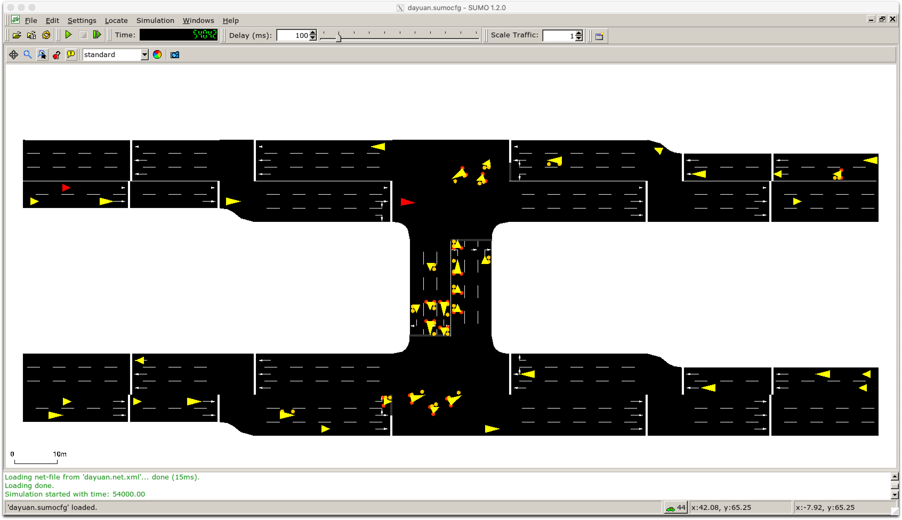

# 3rd SUMO project using TraCI

This is a SUMO example using [**TraCI**](https://sumo.dlr.de/docs/TraCI.html).


I want to implement this road network:


## Example description
Our example plays on a simple signalized intersection with four approaches. We only have traffic on the horizontal axis and important vehicles (like trams, trains, fire engines, ...) on the vertical axis from north to south. On the approach in the north we have an induction loop to recognize entering vehicles. While no vehicle enters from the north we give green on the horizontal axis all the time but when a vehicle enters the induction loop we switch the signal immediately so the vehicle can cross the intersection without a stop. [1]


## Step 1: Nodes
    
All nodes are set up in ["dayuan.cross.nod.xml"](../docs/tutorial/traci_tls_dyt/data/dayuan.cross.nod.xml) file. In this file, each node is assigned with its coordinates (x,y).

The definitions of the attributes in the node file are listed below.

- (a) ***id***: the ID name of the node, defined by users with numbers, word strings or both.
- (b) ***x***: the x-coordinate location of the defined node (in meters)
- (c) ***y***: the y-coordinate location of the defined node (in meters)
- (d) ***type***: the signal control type of the defined node. It is an optional attribute and defined with priority and traffic_light for unsignalized and signalized intersections respectively.

## Step 2: Edges (links)

All edges (road segments, or called "link" in SUMO) are set up in ["dayuan.cross.edg.xml"](../docs/tutorial/traci_tls_dyt/data/dayuan.cross.edg.xml) file.

The defined attributes include:

- (a) ***id***: link ID, defined by users with numbers, word strings or both.
- (b) ***from***: ID of the upstream node of the respective link.
- (c) ***to***: ID of the downstream node of the respective link.
- (d) ***priority***: driving priority based on traffic regulations and is defined with numbers. The higher the number, the higher the priority for the respective road. The priority information will override information from the node file, if both of them exist.
- (e) ***numLanes***: number of lanes on the respective road.
- (f) ***speed***: maximum allowed link speed.
- // We can also put priority, numLanes, speed properties in a seperate *.typ.xml as [example 2](2ndSimpleSumo.md).
- // (g) type: ID of the link type, defined in the link type file. 
- // (h) allow/disallow: ID of the vehicle group which is defined in the SUMO and might not be identical with the vehicle types defined by users. 


## Step 3: Connections between lanes

Each edges are connected with others. The connection between edges are set up in in ["dayuan.cross.con.xml"](../docs/tutorial/traci_tls_dyt/data/dayuan.cross.con.xml) file.

```
NOTE: If each edge has more than 2 lanes, they can not connect to each other freely. The connection between each lanes are set up in "dayuan.cross.con.xml" file using "fromLane/toLane" attributes, see more on 2nd example.
```

The meaning of each attribute is as following:

- (a) ***from***: ID of the link which the traffic movements will be specified.
- (b) ***to***: ID of the link which is the downstream link of the above defined link.
- // (c) fromLane/toLane: lane number of the defined link in (a) and the lane number of the link in (b), which are connected.


## Step 4: Network generation  (netconvert)

All 3 files above will be used to generate the network file ["dayuan.cross.net.xml"](../docs/tutorial/traci_tls_dyt/data/dayuan.cross.net.xml) using [`netconvert` command](https://sumo.dlr.de/docs/NETCONVERT.html) (see [more](https://sumo.dlr.de/docs/Networks/Import.html) about using `netconvert` to convert other third-party formats to network file "*.net.xml"). 

Before that, let set up all parameters into 1 file ["dayuan.cross.netccfg"](../docs/tutorial/traci_tls_dyt/data/dayuan.cross.netccfg) since there are too much parameters. 

In this parameter file ["dayuan.cross.netccfg"](../docs/tutorial/traci_tls_dyt/data/dayuan.cross.netccfg),  we will set ["dayuan.cross.nod.xml"](../docs/tutorial/traci_tls_dyt/data/dayuan.cross.nod.xml),  ["dayuan.cross.edg.xml"](../docs/tutorial/traci_tls_dyt/data/dayuan.cross.edg.xml), ["dayuan.cross.con.xml"](../docs/tutorial/traci_tls_dyt/data/dayuan.cross.con.xml) all 3 above files as input files. And then set a out put file, which is our network file ["dayuan.cross.net.xml"](../docs/tutorial/traci_tls_dyt/data/dayuan.cross.net.xml).

As shown in SUMO project files structure:


BTW, If u-turn movements are not allowed, the command `<no-turnarounds value="true"/>` should be added to the configuration file. As stated previously, the prohibition of u-turn movements can only be conducted globally.

Run `netconvert -c dayuan.cross.netccfg` to generate file ["dayuan.cross.net.xml"](../docs/tutorial/quickstart_dyt/data/dayuan.cross.net.xml).

```
$ netconvert -c dayuan.cross.netccfg
Loading configuration... done.
Parsing nodes from 'dayuan.cross.nod.xml'... done.
Parsing edges from 'dayuan.cross.edg.xml'...
Warning: Edge's '53i' from- and to-node are at the same position.
Warning: Edge's '53o' from- and to-node are at the same position.
done.
Parsing connections from 'dayuan.cross.con.xml'... done.
 Import done:
   9 nodes loaded.
   16 edges loaded.
Removing self-loops... done (0ms).
Removing empty nodes... done (0ms).
   0 nodes removed.
Moving network to origin... done (0ms).
Computing turning directions... done (0ms).
Assigning nodes to traffic lights... done (0ms).
Sorting nodes' edges... done (0ms).
Computing node shapes... done (1ms).
Computing edge shapes... done (0ms).
Computing node types... done (0ms).
Computing priorities... done (0ms).
Computing approached edges... done (0ms).
Guessing and setting roundabouts... done (0ms).
Computing approaching lanes... done (0ms).
Dividing of lanes on approached lanes... done (0ms).
Processing turnarounds... done (0ms).
Rechecking of lane endings... done (0ms).
Computing traffic light control information... done (0ms).
Computing node logics... done (0ms).
Computing traffic light logics... done (1ms).
 1 traffic light(s) computed.
Building inner edges... done (0ms).
-----------------------------------------------------
Summary:
 Node type statistics:
  Unregulated junctions       : 0
  Priority junctions          : 9
  Right-before-left junctions : 0
 Network boundaries:
  Original boundary  : -51.00,-50.00,51.00,51.00
  Applied offset     : 51.00,50.00
  Converted boundary : 0.00,0.00,102.00,101.00
-----------------------------------------------------
Writing network... done (3ms).
Success.
```

## Step 5: Traffic demand (randomTrips.py)

I 2nd example I set up traffic flow information into ["dayuan.rou.xml"](../docs/tutorial/quickstart_dyt/data/dayuan.rou.xml) by hand. **Firstly** I define 4 types of cars. 
**Secondly** 12 routes are assigned to let each vehicle to select from.
**Thirdly** it's the traffic flow (traffic demand)/route design.

## 5.1 Generate a route: 

BUT here, I want to ***generate randomly a route*** instead of doing to by hand.

[Traffic Demand](https://sumo.dlr.de/docs/Demand/Introduction_to_demand_modelling_in_SUMO.html) is the word we use to descripte how many vehicles we will have, types of vehicles, the route of each vehicles.

A ***trip*** is a vehicle movement from one place to another defined by the starting edge (street), the destination edge, and the departure time. 

A ***route*** is an expanded trip, that means, that a route definition contains not only the first and the last edge, but all edges the vehicle will pass.

There are several methods to generate routes for SUMO. DUAROUTER is one of them.
[DUAROUTER (dynamic user assignment (DUA) router)](https://sumo.dlr.de/docs/DUAROUTER.html) is used to turn your trips into routes. Another popular way is using Randomization `Tools/Trip#randomTrips.py`, which is a quick way to get some traffic if you do not have access to any measurements but the results are highly unrealistic. See [Tools/Trip#randomTrips.py](https://sumo.dlr.de/docs/Tools/Trip.html#randomtripspy).

## Step 6: Run

Then I set up some configurations for running into file ["dayuan.sumocfg"](../docs/tutorial/quickstart_dyt/data/dayuan.sumocfg), includeing net-file ["dayuan.net.xml"](../docs/tutorial/quickstart_dyt/data/dayuan.net.xml), route-files ["dayuan.rou.xml"](../docs/tutorial/quickstart_dyt/data/dayuan.rou.xml) and gui-settings-file ["dayuan.settings.xml"](../docs/tutorial/quickstart_dyt/data/dayuan.settings.xml).


After having all above, we can run the simulation using this command `sumo-gui -c dayuan.sumocfg`. 


## Result

Few screenshots of runing the simulation:




FYI, in ["dayuan.settings.xml"](../docs/tutorial/traci_tls_dyt/data/dayuan.settings.xml) I set the run time from 54000 to 54100. You can change it as you want.

```
    <time>
        <begin value="54000"/>
        <end value="54100"/>
    </time>
```

----
Reference:

[1] https://sumo.dlr.de/docs/Tutorials/TraCI4Traffic_Lights.html#TraCI

