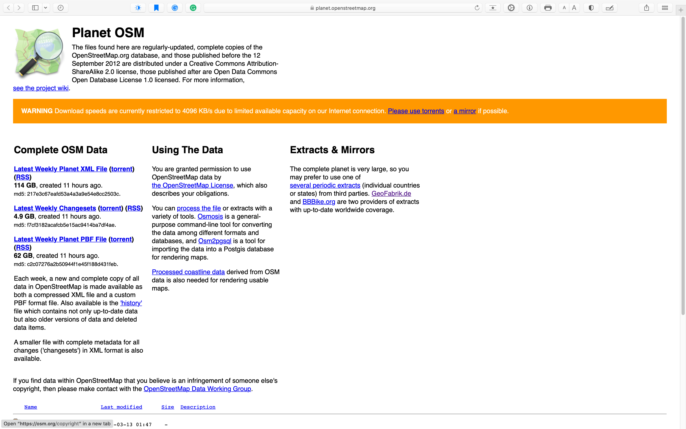

# Generate NYC road net file using OpenStreetMap

## 1. Download OSM file from OSM website.
I followed this page. Go to the [OSM website](https://planet.openstreetmap.org). Select "geofabrik". Find the city you want. I choose NYC.



There are multiple formats. I choose this format:

    Other Formats and Auxiliary Files
    district-of-columbia-latest.osm.bz2, yields OSM XML when decompressed; use for programs that cannot process the .pbf format. This file was last modified 1 day ago. File size: 23.6 MB; MD5 sum: a7bfe69febfafa20f2323a40627b34e3.

## 2. Convert osm to net file

There are mulitple pages talking about this:
- https://sumo.dlr.de/docs/OpenStreetMap_file.html
- https://sumo.dlr.de/docs/Networks/Import/OpenStreetMap.html#junctions
- https://sumo.dlr.de/docs/Tutorials/Import_from_OpenStreetMap.html

Finally I choose to use `netconvert` command:
```python
netconvert --type-files ../../data/typemap/osmNetconvert.typ.xml,../../data/typemap/osmNetconvertUrbanDe.typ.xml \
     --osm-files district-of-columbia-latest.osm --output-file district-of-columbia.net.xml \
     --geometry.remove --roundabouts.guess --ramps.guess \
     --junctions.join --tls.guess-signals --tls.discard-simple --tls.join 
```

`--> 221M Sep 27 06:43 district-of-columbia.net.xml`

Rationale:
- There are multiple degrees of freedom when importing data from OSM. SUMO provides recommended **typemaps in the folder <SUMO_HOME>/data/typemap/**. They are explained below.
- ***osmNetconvert.typ.xml***: default settings. appropriate for rural and motorway scenarios. This is used in the absence of user-specified types. All other typemaps are intended as patches to this typemap
- ***osmNetconvertUrbanDe.typ.xml***: Changes default speeds to reflect typical urban speed limits (50km/h)
- **--geometry.remove**: Simplifies the network (saving space) without changing topology
- **--roundabouts.guess**: This sets the appropriate right-of-way rules at roundabouts. (Explicit right-of-way rules are not imported from OSM). If this option is not used and roundabouts are not defined manually, then traffic jams will likely occur at roundabouts
- **--ramps.guess**. Acceleration/Deceleration lanes are often not included in OSM data. This option identifies likely roads that have these additional lanes and causes them to be added
- **--junctions.join**. See #Junctions
- **--tls.guess-signals, --tls.discard-simple, --tls.join**. See #Traffic_Lights

It tells "Success." when finish.


## 3. Importing additional Polygons (Buildings, Water, etc.)
OSM-data not only contains the road network but also a wide range of additional polygons such as buildings and rivers. These polygons can be imported using POLYCONVERT and then added to a sumo-gui-configuration.


```
polyconvert --net-file district-of-columbia.net.xml --osm-files district-of-columbia-latest.osm --type-file ../../data/typemap/osmPolyconvert.typ.xml -o district-of-columbia.poly.xml
```
`--> 63M Sep 27 06:45 district-of-columbia.poly.xml`

It tells "Success." when finish.

The created polygon file "district-of-columbia.poly.xml" can then be added to a sumo-gui configuration "*.sumocfg" file:

```xml
 <configuration>
     <input>
         <net-file value="district-of-columbia.net.xml"/>
         <additional-files value="district-of-columbia.poly.xml"/>
     </input>
 </configuration>
 ```

 ## 4. trips & routes

 `python3.7.3 ../../tools/randomTrips.py -n district-of-columbia.net.xml -r district-of-columbia.rou.xml --fringe-factor 100 --end 1800 --period 0.5`

- ../../../tools/randomTrips.py: Find the correct path of randomTrips.py file.
- -n *.net.xml: As input file. Usually it's a network file.
- //-o trips.trips.xml: As output file. randomTrips.py generates a trip file. Not route file by default.
- //--route-file dayuan.cross.rou.xml: Add "--route-file" attribute it will call DUAROUTER automatically backend and generate route file for us.
- --fringe-factor 100: The option --fringe-factor increases the probability that trips will start/end at the fringe of the network. If the value 10 is given, edges that have no successor or no predecessor will be 10 times more likely to be chosen as start- or endpoint of a trip. This is useful when modelling through-traffic which starts and ends at the outside of the simulated area.
- -p 1: The arrival rate is controlled by option --period/-p (default 1). By default this generates vehicles with a constant period and arrival rate of (1/period) per second. By using values below 1, multiple arrivals per second can be achieved.

 ```shell
 $ python ../../tools/randomTrips.py -n district-of-columbia.net.xml -r district-of-columbia.rou.xml --fringe-factor 100 --end 1800 --period 0.5
calling  /usr/local/opt/sumo/share/sumo/bin/duarouter -n district-of-columbia.net.xml -r trips.trips.xml -o district-of-columbia.rou.xml --ignore-errors --begin 0 --end 1800.0 --no-step-log --no-warnings
Success.
 ```

`--> 257K Sep 27 07:10 trips.trips.xml`

`--> 5.0M Sep 27 07:11 district-of-columbia.rou.alt.xml`

`--> 4.6M Sep 27 07:11 district-of-columbia.rou.xml`

